PAPER

View Article Online

View Journal | View Issue

Check for updates

Cite this: Energy Adv., 2024, 3, 2512

# Optical constants manipulation of formamidinium lead iodide perovskites: ellipsometric and spectroscopic twigging†

Mohd Taukeer Khan, a Muhammed P. U. Haris, b Baraa Alhouri,a Samrana Kazimbcd and Shahzada Ahmad *bd

Unraveling the knowledge of the complex refractive index and photophysical properties of the perovskite layer is paramount to uncovering the physical process that occurs in a perovskite solar cell under illumination. Herein, we probed the optical and photophysical properties of $\mathsf { F A P b } | _ { 3 }$ (FAPI) and $\mathsf { C s } _ { 0 . 1 } \mathsf { F A } _ { 0 . 9 } \mathsf { P b } | _ { 3 }$ (CsFAPI) thin films deposited from pre-synthesized powder, by the spectroscopic ellipsometer and time-resolved fluorescence spectra. We determined the complex refractive index of perovskite films by fitting the measured spectroscopic ellipsometer data with the three-oscillator Tauc–Lorentz (T–L) model. We deduced that the CsFAPI thin film had a slightly lower absorption coefficient than the FAPI, but a higher refractive index and dielectric constant than the FAPI. The peak photoluminescence (PL) emission of FAPI and CsFAPI thin film on glass substrates was observed around 803 nm and 799 nm, respectively, while on ITO substrates, both FAPI and CsFAPI thin film was quenched and red-shifted to 816 nm. The methylammonium free pure CsFAPIbased perovskite solar cell fabricated in $p { - } i { - } n$ configuration, measured a competitive efficiency of $1 6 . 1 4 \%$ , characterized by a $\scriptstyle { \mathcal { J } } _ { \mathsf { S C } }$ of $2 3 . 9 9 5 ~ \mathsf { m A c m } ^ { - 2 }$ , $V _ { \mathrm { O C } }$ of 912 mV, and FF of $73 . 7 4 \%$ .

Received 28th May 2024, Accepted 26th August 2024

DOI: 10.1039/d4ya00339j

rsc.li/energy-advances

# 1. Introduction

Perovskite solar cells (PSCs) are categorized by their high power conversion efficiency (PCE) on par with the c-Si solar cells1 but suffer in terms of a short life span. Methylammonium lead triiodide $\left( { \bf M A P b I } _ { 3 } \right)$ is the most investigated perovskite active layer, however, it undergoes a transition from the tetragonal to the cubic phase around $5 5 ~ ^ { \circ } \mathrm { C }$ . which impacts its electronic band structure and subsequently deteriorates the device performance.2–8 This issue centered the research focus on the formamidinium lead iodide $\left( \mathrm { F A P b I } _ { 3 } \right.$ , FAPI) with an optimum bandgap close to the Shockley–Queisser limit. FAPI has delivered outstanding device performance with a PCE of over $2 6 \%$ with the additives.9–13 Nevertheless, FAPI undergoes an adverse phase transition from a photoactive black-colored $\nsim$ -phase $( E _ { \mathrm { g } } ~ \sim ~ 1 . 4 7 ~ \mathrm { e V } )$ to a photo-inactive yellow-colored d-phase $( E _ { \mathrm { g } } \sim 2 . 4 3 ~ \mathrm { e V } )$ at room temperature14 Various techniques have

a Department of Physics, Faculty of Science, Islamic University of Madinah, Prince Naifbin Abdulaziz, Al Jamiah, Madinah 42351, Kingdom of Saudi Arabia   
b BCMaterials, Basque Center for Materials, Applications, and Nanostructures, UPV/ EHU Science Park, 48940, Leioa, Spain. E-mail: shahzada.ahmad@bcmaterials.net   
c Materials Physics Center, CSIC-UPV/EHU, Paseo Manuel de Lardizabal 5, 20018, Donostia-San Sebastian, Spain   
d IKERBASQUE, Basque Foundation for Science, Bilbao, 48009, Spain   
† Electronic supplementary information (ESI) available. See DOI: https://doi.org/ 10.1039/d4ya00339j

been identified to mitigate the phase transition in FAPI, including A- and X-site doping, Lewis acid and base additivisation, and 2D/3D perovskite configurations. Akin to the prior reports in $\mathbf { M A P b } \mathbf { I } _ { 3 }$ perovskites, mixed A-site cation configuration impacts the band structure and thus device performance. Moreover, most research works are being carried out at laboratory levels. The lab-to-lab reproducibility issue owing to the differences in the atmospheric condition, precursor quality, and weighing errors, is identified as one of the challenges to upscaling the high-performance PSCs to the module level. In this context, recently emerged pre-synthesized powder shows high potential towards these existing concerns. The yellow-colored $\mathrm { F A P b I } _ { 3 }$ and $\mathrm { C s _ { 0 . 1 } F A _ { 0 . 9 } P b I _ { 3 } }$ (CsFAPI) powders in the d-phase exhibited high tolerance towards the weighing errors by reducing the number of weighing processes. Additionally, the use of low-purity precursors reduced the fabrication cost without affecting the final device performance.15–17 Moreover, the pre-synthesized powder route to develop microcrystals suppresses the anomalous $J { - } V$ hysteresis observed in PSCs by mitigating the defect states17–19 and also discards the issue of Pb impurities present in the Pb precursors and anomalies in the weighing of the precursors to control the exact stoichiometry.

The performance of a PSC depends upon the quality of the perovskites layer (e.g., roughness, grain size, interface, etc.) and its optical properties that include refractive index $( n )$ , extinction coefficient $\left( \kappa \right)$ , real and imaginary dielectric constants $\left( \varepsilon _ { \mathrm { r } } , \varepsilon _ { \mathrm { i } } \right)$ .

Therefore, to design efficient and stable PSCs, precise knowledge of these parameters is essential. The refractive index and dielectric constants are generally evaluated from absorptive, reflective, and transmittance spectroscopy.20–26 As the perovskitebased photonic devices including solar cells, laser, photodetector, light-emitting diodes, or tandem solar cells are fabricated by stacks of multilayers to manage the absorption/emission of light and charge carrier injection and extraction. Spectroscopic ellipsometry is a non-destructive, non-invasive technique that can measure the optical and structural properties of thin films with high sensitivity $( \sim 0 . 1 \mathring \mathrm { A } )$ and accuracy. Spectroscopic ellipsometry techniques can characterize the bulk, surfaces, interfaces, and multilayer stacks of thin films, as well as their thickness, electronic band structure, crystallinity, composition, interfacial diffusion, absorption coefficient, etc.27–31 Though other spectroscopic methods, such as absorptive, reflective, and transmittance spectroscopy, can also provide similar information on the optical properties, thickness, and roughness of thin films, however, they are less sensitive and comprehensive than spectroscopic ellipsometry. Moreover, typically the perovskite thin films are deposited by solution processing which can create pinholes on the film surface.32–34 These pinholes reduce the quality of perovskite thin films by decreasing the polarization of light or scattering the light in different directions and can decrease the refractive index of perovskite. From the SE, we can uncover the void present in the perovskite layers.35 Furthermore, the microstructure, crystal quality, chemical composition, or electrical conductivity also influence the optical properties of thin films and thus device performance therefore knowledge of the complex refractive index and dielectric function is essential to develop new materials36,37

Reports dealing with the spectroscopic ellipsometer measurements of $\mathbf { M A P b I } _ { 3 }$ , 38–40 $\mathrm { C H _ { 3 } N H _ { 3 } P b B r _ { 3 } }$ , 41 $\mathrm { F A P b I } _ { 3 }$ , 42–44 CsPbBr3, 45 $\mathbf { F A } _ { x } \mathbf { M } \mathbf { A } _ { 1 - x } \mathbf { P } \mathbf { b } \mathbf { I } _ { 3 }$ single crystals,46 however, to our knowledge there are no detailed reports available on the optical and dielectric properties of $\mathrm { F A P b I } _ { 3 }$ and $\mathbf { C } s _ { 0 . 1 } \mathbf { F A } _ { 0 . 9 } \mathbf { P b } \mathbf { I } _ { 3 }$ thin films fabricated by powder methodology. Here we investigated the optical, photophysical, and electrical properties of $\mathrm { F A P b I } _ { 3 }$ and $\mathbf { C } s _ { 0 . 1 } \mathbf { F A _ { 0 . 9 } P b I _ { 3 } }$ thin films fabricated via pre-synthesized powder by recording the spectroscopic ellipsometer, time-resolved fluorescence spectra, and Hall-effect measurements. Moreover, we investigated the impact of substrates (glass and ITO) on these properties as well as their solar cells merits.

# 2. Results and discussions

# Spectroscopic ellipsometer

The spectroscopic ellipsometer evaluates the optical constant by determining the alteration in the polarization state of the light as it reflects through the film surface. It assesses the fluctuation in the amplitude ratio $( \Psi )$ and phase difference (D) of the reflected light, as specified in the relationship:35,47,48

$$
\rho = \tan (\Psi) \mathrm {e} ^ {i \Delta} = \frac {r _ {\mathrm {p}}}{r _ {\mathrm {s}}}
$$

where, rp $r _ { \mathrm { p } } = \frac { E _ { r _ { \mathrm { p } } } } { E _ { i _ { \mathrm { p } } } }$ Erp and rs $r _ { \mathrm { s } } = { \frac { E _ { r _ { \mathrm { s } } } } { E _ { i _ { \mathrm { s } } } } }$ Ers refer to the parallel and perpendi-Ei cular Fresnel reflection coefficients, respectively. The acquired spectral analysis of FAPI and CsFAPI thin films for different configurations is presented in Fig. S1 (ESI†). The peaks and valleys observed in $\psi$ and D ascribe to the interference and describe the n and $\kappa .$ , respectively. The thickness and optical parameters of perovskite layers were extracted by fitting the measured ellipsometer data with a three-oscillator Tauc–Lorentz (T–L) model.48–50 The T–L dispersion model, developed by Jellison and Modine, marks a significant advancement in characterizing the frequencydependent complex permittivity of amorphous semiconductors. Recently, this model has been extended to model the dielectric function of transparent conductive oxides51,52 and perovskite materials.35,42,53 By integrating the principles of Tauc and Lorentz, it addresses the limitations of the Forouhi–Bloomer model, particularly for perovskite films, providing an enhanced fit for the complex refractive index and improving the understanding of optical properties. The three-oscillator model, which incorporates multiple oscillators to account for distinct electronic transitions, significantly enhances fitting accuracy, crucial for perovskite thin films. This model offers a precise fit for both the complex refractive index and the dielectric function, essential for delineating the unique optical properties of perovskite films. The refined fitting capabilities of the three-oscillator T–L model are indispensable for elucidating and optimizing perovskite films in driving the development of high-efficiency optoelectronic devices. In the T–L model, the imaginary part of the dielectric function, ei, is derived from the product of the bandgap of amorphous materials and the Lorentz model.48 The Tauc gap, $E _ { \mathrm { g } } ,$ is given by:54

$$
\varepsilon_ {\mathrm {i}} = A _ {\mathrm {T a u c}} \frac {\left(E - E _ {\mathrm {g}}\right) ^ {2}}{E ^ {2}}
$$

The expression for $\varepsilon _ { \mathrm { i } }$ in the Tauc–Lorentz model is ei:

$$
\varepsilon_ {\mathrm {i}} = \left\{ \begin{array}{c c} \frac {A \cdot E _ {0} \cdot C \cdot \left(E - E _ {\mathrm {g}}\right) ^ {2}}{E \left[ \left(E ^ {2} - E _ {0} ^ {2}\right) ^ {2} + C ^ {2} \cdot E ^ {2} \right]}, & E > E _ {\mathrm {g}} \\ 0 & E \leq E _ {\mathrm {g}} \end{array} \right.
$$

The real part of the dielectric function, $\varepsilon _ { \mathrm { { r } ; } }$ , in the T–L model is given by:

$$
\begin{array}{l} \varepsilon_ {\mathrm {r}} = \varepsilon_ {\mathrm {r}} (\infty) + \frac {A \cdot C}{2 \cdot \pi \cdot \xi^ {4}} \frac {a _ {\ln}}{\alpha \cdot E _ {0}} \cdot \ln \left[ \frac {E _ {0} ^ {2} + E _ {\mathrm {g}} ^ {2} + \alpha \cdot E _ {\mathrm {g}}}{E _ {0} ^ {2} + E _ {\mathrm {g}} ^ {2} - \alpha \cdot E _ {\mathrm {g}}} \right] \\ - \frac {A \cdot a _ {\text {a t a n}}}{\pi \cdot \xi^ {4} \cdot E _ {0}} \left[ \pi - a \cdot \tan \left(\frac {2 \cdot E _ {\mathrm {g}} + \alpha}{C}\right) + a \cdot \tan \left(\frac {\alpha - 2 \cdot E _ {\mathrm {g}}}{C}\right) \right] \\ + \frac {2 \cdot A \cdot E _ {0}}{\pi \cdot \zeta^ {4} \cdot \alpha} \left\{E _ {\mathrm {g}} \cdot \left(E ^ {2} - \gamma^ {2}\right) \cdot \left[ \pi + 2 \cdot a \cdot \tan \left(\frac {\gamma^ {2} - E _ {\mathrm {g}} ^ {2}}{\alpha \cdot C}\right) \right] \right\} \\ - \frac {A \cdot E _ {0} \cdot C \cdot \left(E ^ {2} + E _ {\mathrm {g}} ^ {2}\right)}{\pi \cdot \xi^ {4} \cdot E} \cdot \ln \left(\frac {| E - E _ {\mathrm {g}} |}{E + E _ {\mathrm {g}}}\right) \\ + \frac {2 \cdot A \cdot E _ {0} \cdot C \cdot E _ {\mathrm {g}}}{\pi \cdot \xi^ {4}} \cdot \ln \left(\frac {\left| E - E _ {\mathrm {g}} \right| \cdot \left(E + E _ {\mathrm {g}}\right)}{\sqrt {\left(E _ {0} ^ {2} - E _ {\mathrm {g}} ^ {2}\right) ^ {2} + E _ {\mathrm {g}} ^ {2} \cdot C ^ {2}}}\right) \\ \end{array}
$$

where:

$$
a _ {\ln} = \left(E _ {\mathrm {g}} ^ {2} - E _ {0} ^ {2}\right) \cdot E ^ {2} + E _ {\mathrm {g}} ^ {2} \cdot C ^ {2} - E _ {0} ^ {2} \cdot \left(E _ {0} ^ {2} + 3 \cdot E _ {\mathrm {g}} ^ {2}\right)
$$

$$
a _ {a \tan} = \left(E ^ {2} - E _ {0} ^ {2}\right) \cdot \left(E _ {0} ^ {2} + E _ {\mathrm {g}} ^ {2}\right) + E _ {\mathrm {g}} ^ {2} \cdot C ^ {2}
$$

$$
\xi^ {4} = \left(E ^ {2} - E _ {0} ^ {2}\right) \cdot \left(E _ {0} ^ {2} + E _ {\mathrm {g}} ^ {2}\right) + \frac {\alpha^ {2} \cdot C ^ {2}}{4}
$$

$$
\alpha = \sqrt {4 \cdot E _ {0} ^ {2} - C ^ {2}}
$$

$$
\gamma = \sqrt {4 \cdot E _ {0} ^ {2} - \frac {C ^ {2}}{2}}
$$

here, $\varepsilon _ { \mathrm { r } } ( \infty )$ is a parameter associated with high frequency, A and $C$ are the amplitude and broadening parameters of $\varepsilon _ { \mathrm { i } }$ , respectively, $E _ { \mathrm { g } }$ is the energy bandgap and $E _ { 0 }$ is the peak transition energy.42,45

The solution-processed perovskite thin film may contain pinholes at the surface and they were taken into consideration through modeling the perovskite layer by effective medium approximation (EMA) with two layers: (i) perovskites bulk layer of thickness $L$ and (ii) perovskite surface layer with void and oxygen having thickness r as shown in Fig. 1a and b.55–58 $r$ Additionally, we have used initial energies of 1.55 eV, 2.18 eV, and $2 . 7 0 ~ \mathrm { e V }$ for fitting.

It can be deduced from Fig. S1 (ESI†) that the T–L model is in agreement with the measured $\psi$ and D for all films with fitting $\chi ^ { 2 } < 0 . 1 8$ , subsequent fit parameters are tabulated in Table S1 $\left( \mathrm { E S I \dag } \right)$ . Film thickness of FAPI samples: glass/FAPI and ITO/FAPI were obtained to be: $L \sim 3 7 4 ~ \mathrm { n m }$ , and $3 6 0 ~ \mathrm { { n m } }$ , with corresponding roughness of $r \sim 1 5 ~ \mathrm { n m }$ , and $2 3 \mathrm { ~ n m }$ , in that order. Alternatively, the film thickness of Glass/CsFAPI and ITO/CsFAPI were calculated to be $L \sim 3 8 2 ~ \mathrm { n m }$ and $3 6 4 ~ \mathrm { { n m } }$ with a slightly higher roughness of $r \sim 2 1 ~ \mathrm { { n m } }$ and $1 5 ~ \mathrm { n m }$ . It can be deduced from Table S1 (ESI†) that all the transitions such as $E _ { 1 }$ , $E _ { 2 }$ , and $E _ { 3 }$ were shifted to lower energies for the perovskites films fabricated on ITO as compared to the perovskites on glass. The high-frequency dielectric constant $\varepsilon _ { \infty }$ found to be lower for the CsFAPI films as compared to the FAPI thin films owing to the reduced crystallinity.

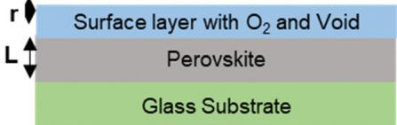  
(a)

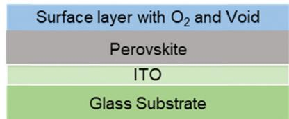  
Fig. 1 The optical model employed to fit the spectroscopic ellipsometer data of perovskites films fabricated on (a) glass, and (b) ITO substrates.

Fig. 2 depicts the parameters obtained through the fitting of spectroscopic ellipsometer data for FAPI thin films, while Fig. 3 represents the same for the CsFAPI thin films. The refractive index of FAPI thin film deposited on a glass substrate exhibited a peak around $5 2 0 ~ \mathrm { { n m } }$ with a refractive index $( n ) \sim 2 . 3 3$ , and a hump ranging from $7 0 0 ~ \mathrm { { n m } }$ to $9 5 0 \ \mathrm { n m }$ , which is lower than the previously reported value of 2.4–2.6.42 The peak at low energy corresponds to the transition through the energy bandgap, while the peak at high energy corresponds to an indirect transition. However, the value of $n$ was found to decrease slightly for the perovskite films deposited on ITO with $n \sim 2 . 2 2$ . The drop in n on the perovskite thin films deposited on ITO substrates is associated with the decrease in the polarizability of perovskite films due to charge transfer, an increase in surface roughness, and a drop in crystallinity of the perovskite films.59,60

The refractive index spectra of CsFAPI thin film deposited on glass substrates exhibit two peaks at $5 3 0 \ \mathrm { n m }$ and $8 0 0 \ \mathrm { n m }$ with corresponding refractive index $n \sim 2 . 8 1$ and 2.59, respectively, higher than FAPI films. This value of n for FAPI is in a similar range reported by Xie et al.61 while slightly higher than reported by Ndione et al. of 2.5.42 The low-energy peak ascribes to the transition through the energy bandgap whereas the high-energy transition corresponds to the indirect transition through the bandgap. One possible reason for a higher refractive index of CsFAPI than FAPI is that CsFAPI has a larger molecular polarizability than FAPI. CsFAPI has a larger cation $( \cos ^ { + } )$ than FAPI $\left( \mathrm { F A } ^ { + } \right)$ , suggesting that CsFAPI has higher electron density and a larger molecular size. This could result in a higher polarizability and a higher refractive index for CsFAPI as compared to FAPI. Moreover, CsFAPI has a higher energy bandgap than FAPI, implying less absorption of light in CsFAPI and a higher n value. The value of $n$ was found to be similar for the samples, glass/CsFAPI and ITO/CsFAPI.

Fig. 2b depicts the extinction coefficient k of FAPI thin films. The peak was observed at $4 8 1 ~ \mathrm { { n m } }$ with a value of $\kappa \sim 1 . 0 5$ for

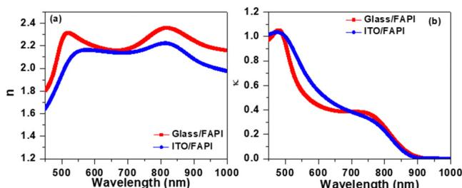

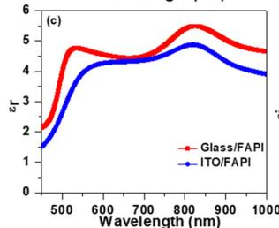

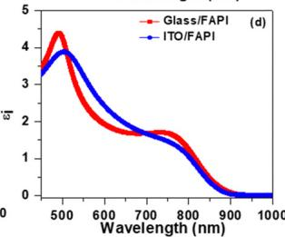  
Fig. 2 Optical constants: (a) refractive index (b) extinction coefficient, (c) dielectric constant, and (d) dielectric loss of FAPI thin films fabricated in different substrates.

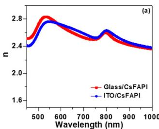

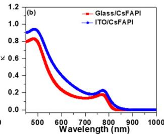

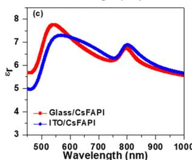

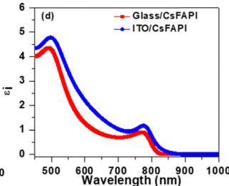  
Fig. 3 Optical constants: (a) refractive index (b) extinction coefficient, (c) dielectric constant, and (d) dielectric loss of CsFAPI perovskites thin films fabricated on different substrates.

Glass/FAPI. The spectra also exhibit a wide shoulder ranging from $6 6 0 \ \mathrm { n m }$ to $7 8 0 ~ \mathrm { n m }$ , while ITO/FAPI delivered a similar $\kappa$ value. The extinction coefficient of CsFAPI films was found to be $\kappa \sim 0 . 8 3$ , which is lower than FAPI. Further, the absorption coefficient $\mathscr { X }$ was evaluated using the equation:

$$
\alpha = \frac {4 \pi \kappa}{\lambda}
$$

Fig. 4a and b illustrate the variation in the absorption coefficient of FAPI and CsFAPI films, respectively. The $\mathscr { X }$ was found to be $\sim 3 \times 1 0 ^ { 5 } \mathrm { c m } ^ { - 1 }$ for Glass/FAPI and $2 . 2 \times 1 0 ^ { 5 } \mathrm { c m } ^ { - 1 }$ for Glass/CsFAPI. The value of absorption coefficient in the present study is higher than the previously reported $\left( 2 . 2 \times 1 0 ^ { 5 } \thinspace \mathrm { c m } ^ { - 1 } \right)$ for FAPI thin films fabricated via conventional method62 and exhibits a similar value reported by Kato et al.43 A slight increase in a was noted for ITO/CsFAPI. The lower value of the absorption coefficient of CsFAPI thin films is attributed to the higher bandgap (Table S2 and Fig. S2, $\mathrm { E S I \dag }$ ) in comparison to FAPI, therefore, higher photon energy is required for the absorption in CsFAPI, subsequently lowering the absorption coefficient.

The permittivity constant is associated with the energy band arrangement and is defined through the equation:

$$
\varepsilon = \varepsilon_ {\mathrm {r}} - i \varepsilon_ {\mathrm {i}}
$$

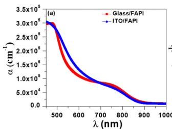

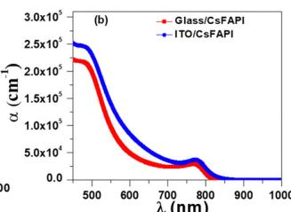  
Fig. 4 The absorption coefficient of (a) FAPI and (b) CsFAPI perovskite thin films.

The real part of permittivity is given through the equation: $\varepsilon _ { \mathrm { { r } } } = n ^ { 2 } - \kappa ^ { 2 }$ and it is associated with the degree of polarization and it increases with polarization. The imaginary part of the permittivity constant is defined through the relation: $\varepsilon _ { \mathrm { i } } = 2 n \kappa$ and it provides information on the energy losses inside the material. The dielectric constant $\varepsilon _ { \mathrm { r } }$ of the two materials are illustrated in Fig. 2c and 3c. The dielectric constant of the Glass/FAPI sample exhibits a peak at $8 2 6 \ \mathrm { n m }$ with $\varepsilon _ { \mathrm { r } } ~ \sim ~ 5 . 5 1$ , corresponds to absorption by free charge carriers, and a secondary transition centered around $5 2 8 ~ \mathrm { n m }$ . The $\varepsilon _ { \mathrm { r } }$ value of FAPI is slightly lower than reported by Kato et al.43 of 6 and 7 by Subedi et al.44 However, the value $\varepsilon _ { \mathrm { r } }$ for CsFAPI thin film was found to be higher and exhibits absorption peaks $\sim 8 0 2 \ \mathrm { n m }$ with a corresponding dielectric constant of 6.90. The dielectric constant and loss of CsFAPI films are higher than FAPI films due to higher polarization in it, attributed to the Cs cations and increase of charge carrier density.

# Photophysical properties

The photophysical properties of FAPI and CsFAPI perovskite thin films were investigated by measuring the steady-state PL and TRPL spectra. The PL emission spectra of Glass/FAPI (Fig. 5a) show peak emission around $8 0 3 ~ \mathrm { { \ n m } }$ and shift to $8 1 6 \ \mathrm { n m }$ when deposited on ITO substrate, which is similar to the value observed previously.63 The red shift in the PL spectra indicates the increase of defect states in the bandgap of FAPI, which is also evident from the ellipsometer analyses in terms of the increase of void $\%$ and roughness. These defects provide non-radiative recombination paths for excited electrons, causing a red shift in PL spectra and a decrease in PL intensity. The PL emission peak for CsFAPI thin film (Fig. 5b) deposited on a glass substrate appeared at $7 9 9 \ \mathrm { n m }$ and showed a reduced intensity when deposited on an ITO substrate. The emission of CsFAPI films was noted to be red-shifted to $8 1 6 \ \mathrm { n m }$ attributed to emission mediated through the defect states. This emission is similar to what we reported previously16 and in close approximation to the previously reported value of $8 1 0 ~ \mathrm { { n m } }$ from the conventional fabrication route.64,65 Moreover, It can be noted from Fig. 5b that the CsFAPI samples exhibit double peak emission. The dual peak emission is ascribed to the selfabsorption effect,66 perovskite phase transition,67 and the coexistence of 2D and 3D perovskite phases68,69 in the thin films. However, here the self-absorption effect is a possible reason for the appearance of double peak emission in ITO/CsFAPI

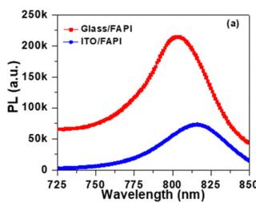

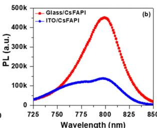  
Fig. 5 Steady-state PL spectra of (a) FAPI and (b) CsFAPI thin films fabricated on different substrates.

because the ITO layer causes the internal reflection in the perovskites layer which is reabsorbed by the perovskites leading to the appearance of dual peak emission.

The TRPL spectra of perovskites on different substrates are shown in Fig. 6. The decay spectra exhibit good fitting to the tri-exponential decay function:70

$$
I (t) = A + B _ {1} \mathrm {e} ^ {- t / \tau_ {1}} + B _ {2} \mathrm {e} ^ {- t / \tau_ {2}} + B _ {3} \mathrm {e} ^ {- t / \tau_ {3}}
$$

where A is a constant, and $B _ { 1 } , B _ { 2 }$ , and $B _ { 3 }$ are relative amplitudes of radiative, nonradiative, and charge transfer processes respectively.71–73 The lifetime $\tau _ { 1 }$ corresponds to the radiative recombination of excited charge carriers transitioning from the highest occupied molecular orbital (HOMO) to the lowest unoccupied molecular orbital (LUMO) level, the lifetime $\tau _ { 2 }$ is associated with the nonradiative recombination through defects states, and the lifetime $\tau _ { 3 }$ is ascribed to the charge transfer process from perovskites to selective contacts. Table 1 presents the fitting parameters and lifetimes, which reveals that the decay corresponds to $\tau _ { 1 }$ is dominant in both perovskites with similar lifetimes in the range from 0.5 ns while the lifetime $\tau _ { 2 }$ found to be slightly higher than $\tau _ { 1 }$ but has a lower contribution. The value of $\tau _ { 1 }$ found to be similar for the perovskites on glass and ITO. The lifetime $\tau _ { 3 }$ found to be the highest among the three and noted to be from a few ns for perovskite on glass substrates and decreases for perovskites on ITO substrate.

# Electrical parameters

The electrical parameters including surface resistivity $( \rho )$ , mobility $( \mu )$ , charge carrier concentration $( n )$ , and sheet resistance $\left( R _ { \mathrm { S h e e t } } \right)$ were evaluated from Hall effect measurements and are listed in Table 2. The surface resistivity of FAPI was found to be $3 . 4 5 \ \times \ 1 0 ^ { 5 } \ \Omega$ cm and noted to be decreased to $2 . 4 1 \times 1 0 ^ { 5 } \Omega \mathrm { ~ c ~ }$ m for CsFAPI film. The higher resistivity of FAPI caused higher sheet resistance, as the sheet resistance of thin film is given by $R _ { \mathrm { S h e e t } } = \rho / _ { t } ,$ , where $t$ is film thickness. Arguably, FAPI exhibited a higher sheet resistance than CsFAPI. The mobility in FAPI thin film was determined to be $\mu = 4 . 7 9 \ \times$ $1 0 ^ { - 1 } \mathrm { c m } ^ { 2 } \mathrm { V } ^ { - 1 } \mathrm { s } ^ { - 1 }$ and it increases to $8 . 8 7 \times { 1 0 } ^ { - 1 } { \mathrm { c m } } ^ { 2 } { \mathrm { V } } ^ { - 1 } { { s } } ^ { - 1 }$ for CsFAPI. The charge carrier density in FAPI found to be $3 . 9 9 \ \times$ $1 0 ^ { 1 3 } \ \mathrm { c m } ^ { - 3 }$ , slightly higher than CsFAPI which has a carrier density of be $2 . 6 1 \times { 1 0 } ^ { 1 3 } \mathrm { ~ c m } ^ { - 3 }$ .

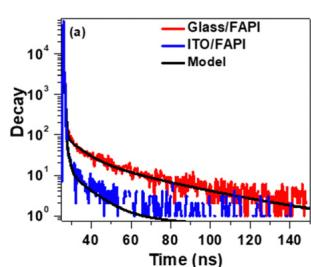

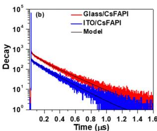  
Fig. 6 Decay spectra of (a) FAPI, and (b) CsFAPI films. The black solid line is a fitting line from the bi-exponential decay function: I tð Þ ¼ A þ B1 e - tt1 þ B2 e - tt2 þ B3 e - tt3 . $I ( t ) = A + B _ { 1 } \mathrm { e } ^ { - \frac { t } { \tau _ { 1 } } } + B _ { 2 } \mathrm { e } ^ { - \frac { t } { \tau _ { 2 } } } + B _ { 3 } \mathrm { e } ^ { - \frac { t } { \tau _ { 3 } } } .$

Table 1 The fitting parameters and lifetime of FAPI and CsFAPI thin films extracted from the tri-exponential decay function   

<table><tr><td>Sample</td><td>τ1(ns)</td><td>B1(%)</td><td>τ2(ns)</td><td>B2(%)</td><td>τ3(ns)</td><td>B3(%)</td><td>τavg(ns)</td><td>χ2</td></tr><tr><td>Glass/FAPI</td><td>0.58</td><td>99.8</td><td>1.31</td><td>0.16</td><td>22.6</td><td>0.04</td><td>0.59</td><td>1.98</td></tr><tr><td>ITO/FAPI</td><td>0.46</td><td>95.3</td><td>0.89</td><td>4.6</td><td>2.2</td><td>0.1</td><td>0.72</td><td>1.47</td></tr><tr><td>Glass/CsFAPI</td><td>0.58</td><td>95.7</td><td>1.57</td><td>4.26</td><td>18.4</td><td>0.04</td><td>0.59</td><td>1.38</td></tr><tr><td>ITO/CsFAPI</td><td>0.45</td><td>96.0</td><td>0.82</td><td>3.7</td><td>1.6</td><td>0.3</td><td>0.46</td><td>1.62</td></tr></table>

Table 2 Electrical parameters of FAPI and CsFAPI extracted from Hall effect   

<table><tr><td>Sample</td><td>ρ (Ω cm)</td><td>μ (cm2V-1s-1)</td><td>n (cm-3)</td><td>RSheet (Ω cm-2)</td></tr><tr><td>FA1</td><td>3.45 × 105</td><td>4.79 × 10-1</td><td>3.99 × 1013</td><td>8.79 × 109</td></tr><tr><td>CFA1</td><td>2.41 × 105</td><td>8.87 × 10-1</td><td>2.61 × 1013</td><td>6.13 × 109</td></tr></table>

We fabricated a $\mathsf { p } { \mathsf { - i } } { \mathsf { - n } }$ type device structure and evaluated the photovoltaics parameters in ITO/PTAA/CsFAPI/PCBM/BCP/ Ag architecture to attest the quality of studied perovskite film, and a typical device from CsFAPI displayed a competitive efficiency of $1 6 . 1 4 \%$ characterized by short-circuit current $\left( J _ { \mathrm { S C } } \right)$ of $2 3 . 9 9 5 ~ \mathrm { \ m A } ~ \mathrm { c m } ^ { - 2 }$ , an open circuit voltage $\left( V _ { \mathrm { O C } } \right)$ of $9 1 2 { \mathrm { ~ m V } } _ { \mathrm { { i } } }$ , and fill factor (FF) of $7 3 . 7 4 \%$ (Fig. S3, ESI†). This is one of the best performances observed in p–i–n configuration for methylammonium-free and additive-free PSCs. The spectral dependence was registered by measuring the external quantum efficiency (EQE) response of the fabricated PSC, which shows its panchromatic absorption characteristics of FAPI (Fig. S4, ESI†), within the absorbance range of 300–850 nm. The integrated urrent density slightly decreases with the current density measured by the J–V curve due to a mismatch in solar illumination.

# 3. Experimental

The glass and ITO-coated glass substrates $\left( \sim 1 0 ~ \Omega ~ \mathrm { c m } ^ { - 1 } \right.$ , Xin Yan Technology Ltd) were sequentially cleaned in the ultrasonic bath for 15 min each of Hellmanex solution, DI water, acetone, and methanol followed by drying with nitrogen gas. All the solutions and films were prepared inside a glove box with $\mathbf { H } _ { 2 } \mathbf { O } < 1$ ppm and $\mathrm { O } _ { 2 } < 1 0$ ppm. The synthesis of ${ \mathsf { a } } { \mathrm { - F A P b I } } _ { 3 }$ and $\mathbf { \alpha } \propto \mathbf { C S _ { 0 . 1 } F A _ { 0 . 9 } P b I _ { 3 } }$ powder was carried out as per our previous report.15,16 For the deposition of perovskites thin films, $6 3 3 ~ \mathrm { m g }$ of ${ \mathsf { a } } { \mathrm { - F A P b I } } _ { 3 }$ and $7 6 5 ~ \mathrm { \ m g }$ of $\mathbf { \alpha } \propto \mathbf { C S _ { 0 . 1 } F A _ { 0 . 9 } P b I _ { 3 } }$ precursors were dissolved in 1 ml of the binary solution DMSO and DMF with a volume ratio of ${ \boldsymbol { 1 } } : { \boldsymbol { 8 } }$ , respectively. The solution was allowed to be stirred for 24 hours at $5 0 ~ ^ { \circ } \mathrm { C }$ inside the glove box. When precursors were completely dissolved, the solution was filtered with a PTFE filter of $0 . 2 2 ~ { \mu \mathrm { m } }$ pore size and kept in the hot plate at $5 0 ~ ^ { \circ } \mathrm { C }$ . The perovskite thin films were deposited by dispensing the $6 0 ~ \mu \mathrm { L }$ precursor solution onto cleaned substrates and spin-coated at 1000 rpm for $^ { 1 0 } \mathrm { ~ \ } \mathbf { s } ,$ , then at 4000 rpm for 30 s. During the last 5 s, chlorobenzene solvent was dispensed to accelerate the crystallization of perovskite films. The spin-casted perovskite thin films were annealed at $1 5 0 ~ ^ { \circ } \mathrm { C }$ for $3 0 \ \mathrm { m i n }$ .

# Device fabrication

The fabrication of the p–i–n devices involved a series of steps that included cleaning, depositing, and annealing materials. The bottom electrodes of the p–i–n device were made of ITOcoated glass substrates that were laser-etched and sonicated in a sequence of solvents: Hellmanex II $( 2 \ \mathrm { \ v o l \% }$ in deionized water), deionized water, ethanol, acetone, and isopropanol. The cleaned ITO substrates were then exposed to UV-ozone for 30 minutes before use. A chlorobenzene solution of PTAA as-HTM was spin-coated onto the ITO substrates at 3000 rpm for 30 s. The perovskite $\mathbf { C } s _ { 0 . 1 } \mathbf { F A } _ { 0 . 9 } \mathbf { P b } \mathbf { I } _ { 3 }$ was prepared following the method reported above. A PCBM solution of $1 5 ~ \mathrm { m g } \mathrm { m L } ^ { - 1 }$ in chlorobenzene was spin-coated on the perovskite film at room temperature at 1000 rpm (500 rpm) for 20 s and then annealed at ${ \bf 9 0 } ^ { \textup { O } } \mathrm { C }$ for 10 min. A BCP layer $\mathbf { \hat { 0 . 5 } \ m g \ m L ^ { - 1 } }$ in IPA) was spincoated on the PCBM layer at 5000 rpm for 40 s. The device was finished by evaporating Ag (80 nm, $< 1 \mathrm { ~ \mathring { A } ~ s ^ { - 1 } } ]$ in a thermal evaporator under low vacuum conditions (below ${ { 1 0 } ^ { - 6 } }$ torr).

# Characterization of perovskites thin-films and device

The optical constants were evaluated with the spectroscopic ellipsometer measurements of thin films in the range of 450– $1 0 0 0 \ \mathrm { n m }$ using Smart-SE from Horiba. The measured ellipsometer data were fitted by the three-oscillator Tauc–Lorentz (T–L) model using the optical model (Fig. 1a and b), and output parameters were evaluated only for the perovskites layer. The PL characteristics and the fluorescence lifetime of the samples were examined using a DeltaFlex TCSPC Lifetime Fluorometer from Horiba. This device enabled us to stimulate the samples with a Delta-diode 510L laser with a peak wavelength of $\lambda =$ $5 1 0 \pm 1 0 ~ \mathrm { n m }$ and to record the fluorescence decay at the maximum emission wavelength. The electrical properties were evaluated using a Hall Effect system from MMR Technologies Inc. that comprised a temperature controller K2000 and a current controller H5000. We conducted the measurements on $1 . 0 \ \mathrm { c m } ^ { 2 }$ square samples with four silver contacts at the corner of the thin film. The absorption spectra of the fabricated thin films were measured using an Agilent Cary 5000 UV-vis-NIR spectrophotometer. The photovoltaics properties were registered with the help of a class 3A Newport solar simulator connected to Keithley.

# 4. Conclusions

To conclude, utilizing pre-synthesized perovskite microcrystals, we examined the optical, photophysical, and electrical characteristics of FAPI and CsFAPI thin films. The spectroscopic ellipsometer investigation of the CsFAPI exhibits a higher refractive index and dielectric constant as compared to pure FAPI thin film. Time-resolved fluorescence decay experiments suggest similar charge carriers’ lifetime for both perovskites. We noted that Cs incorporation improved the electrical characteristics by lowering the resistivity and raising charge carrier mobility, suggesting the beneficial role of Cs in FAPI films for application in solar cells.

# Data availability

The data supporting this article have been included as part of the $\mathrm { E S I } , \dag$ and further raw data are available upon request from the authors.

# Conflicts of interest

There are no conflicts to declare.

# Acknowledgements

This work received funding from the European Union H2020 Programme under a European Research Council Consolidator grant [MOLEMAT, 726360]. Support from the Spanish Ministry of Science and Innovation (PID2019-111774RB-100/ AEI/10.13039/501100011033 and INTERACTION {PID2021- 129085OB-I00}) is also acknowledged. MTK extend their sincere gratitude to the Deanship of Scientific Research at the Islamic University of Madinah for financially supporting this work. We would also like to acknowledge the help of Naveen Harindu Hemasiri.

# References

1 M. A. Green, E. D. Dunlop, G. Siefer, M. Yoshita, N. Kopidakis, K. Bothe and X. Hao, Solar cell efficiency tables (Version 61), Prog. Photovoltaics, 2023, 31, 3–16.   
2 R. Wang, T. Huang, J. Xue, J. Tong, K. Zhu and Y. Yang, Nat. Photonics, 2021, 15, 411–425.   
3 T. C. Sum and N. Mathews, Energy Environ. Sci., 2014, 7, 2518–2534.   
4 J. Chen, X. Cai, D. Yang, D. Song, J. Wang, J. Jiang, A. Ma, S. Lv, M. Z. Hu and C. Ni, J. Power Sources, 2017, 355, 98–133.   
5 F. Khan, B. D. Rezgui, M. T. Khan and F. Al-Sulaiman, Renewable Sustainable Energy Rev., 2022, 165, 112553.   
6 J. A. Christians, P. A. M. Herrera and P. V. Kamat, J. Am. Chem. Soc., 2015, 137, 1530–1538.   
7 F. F. Targhi, Y. S. Jalili and F. Kanjouri, Results Phys., 2018, 10, 616–627.   
8 I. C. Kaya, K. P. S. Zanoni, F. Palazon, M. Sessolo, H. Akyildiz, S. Sonmezoglu and H. J. Bolink, Adv. Energy Sustainability Res., 2021, 2, 2000065.   
9 D. Zhang, H. Zhang, H. Guo, F. Ye, S. Liu and Y. Wu, Adv. Funct. Mater., 2022, 32, 2200174.   
10 J. Jeong, M. Kim, J. Seo, H. Lu, P. Ahlawat, A. Mishra, Y. Yang, M. A. Hope, F. T. Eickemeyer, M. Kim, Y. J. Yoon, I. W. Choi, B. P. Darwich, S. J. Choi, Y. Jo, J. H. Lee, B. Walker, S. M. Zakeeruddin, L. Emsley, U. Rothlisberger, A. Hagfeldt, D. S. Kim, M. Gra¨tzel and J. Y. Kim, Nature, 2021, 592, 381–385.   
11 V. Pool, B. Dou and D. Van Campen, Nat. Commun., 2017, 8, 14075.

12 R. Zhi, C.-Q. Yang, M. U. Rothmann, H.-Q. Du, Y. Jiang, Y.-Y. Xu, Z.-W. Yin, Y.-P. Mo, W. Dong, G. Liang, U. Bach, Y.-B. Cheng and W. Li, ACS Energy Lett., 2023, 8, 2620–2629.   
13 C. Fei, N. Li, M. Wang, X. Wang, H. Gu, B. Chen, Z. Zhang, Z. Ni, H. Jiao, W. Xu, Z. Shi, Y. Yan and J. Huang, Science, 2023, 380, 823–829.   
14 M. P. U. Haris, E. Ruiz, S. Kazim and S. Ahmad, Cell Rep. Phys. Sci., 2023, 4, 101516.   
15 M. P. U. Haris, S. Kazim and S. Ahmad, ACS Appl. Mater. Interfaces, 2022, 14, 24546–24556.   
16 M. P. U. Haris, S. Kazim and S. Ahmad, ACS Appl. Energy Mater., 2021, 4, 2600–2606.   
17 Y. Zhang, S.-G. Kim, D.-K. Lee and N.-G. Park, ChemSusChem, 2018, 11, 1813–1823.   
18 Y. Zhang, S. Seo, S. Y. Lim, Y. Kim, S.-G. Kim, D.-K. Lee, S.-H. Lee, H. Shin, H. Cheong and N.-G. Park, ACS Energy Lett., 2020, 5, 360–366.   
19 J. Wang, F. Meng, R. Li, S. Chen, X. Huang, J. Xu, X. Lin, R. Chen, H. Wu and H.-L. Wang, Sol. RRL, 2020, 4, 2000091.   
20 M. T. Khan, M. Shkir, I. Yahia, A. Almohammedi and S. AlFaify, Superlattices Microstruct., 2020, 138, 106370.   
21 H. E. Atyia and N. A. Hegab, Solid State Sci., 2014, 454, 189–196.   
22 S. Zwerdling, J. Opt. Soc. Am., 1970, 60, 787–790.   
23 D. Poelman and P. F. Smet, J. Phys. D: Appl. Phys., 2003, 36, 1850.   
24 A. A. M. Farag, A. Ashery and M. A. Shenashen, Phys. B, 2012, 407(13), 2404–2411.   
25 S. So¨nmezog˘lu, G. Çankaya and N. Serin, Mater. Technol., 2012, 7, 251–256.   
26 S. So¨nmezog˘lu and O¨. A. So¨nmezog˘lu, Mater. Sci. Eng., C, 2011, 31, 1619–1624.   
27 H. Fujiwara, Spectroscopic Ellipsometry: Principles and Applications. John Wiley & Sons, Ltd., Chichester, 2007.   
28 H. Zhou, Science, 2014, 345, 542–546.   
29 X. Wang, J. Gong, X. Shan, M. Zhang, Z. Xu, R. Dai, Z. Wang, S. Wang, X. Fang and Z. Zhang, J. Phys. Chem. C, 2019, 123, 1362–1369.   
30 S. Brittman and E. C. Garnett, J. Phys. Chem. C, 2016, 120, 616–620.   
31 M. Shirayama, H. Kadowaki, T. Miyadera, T. Sugita, M. Tamakoshi, M. Kato, T. Fujiseki, D. Murata, S. Hara, T. N. Murakami, S. Fujimoto, M. Chikamatsu and H. Fujiwara, Phys. Rev. Appl., 2016, 5, 1–25.   
32 L. Calio, S. Kazim, M. Graetzel and S. Ahmad, Angew. Chem., Int. Ed., 2016, 55, 14522–14545.   
33 M. P. U. Haris, S. Kazim, M. Pegu, M. Deepa and S. Ahmad, Phys. Chem. Chem. Phys., 2021, 23, 9049–9060.   
34 M. Petrovic´, V. Chellappan and S. Ramakrishna, Sol. Energy, 2015, 122, 678–699.   
35 H. Li, C. Cui, X. Xu, S. Bian, C. Ngaojampa, P. Ruankham and A. P. Jaroenjittchai, Sol. Energy, 2020, 212, 48–61.   
36 J. Werner, G. Nogay, F. Sahli, T. C. J. Yang, M. Brauninger, G. Christmann, A. Walter, B. A. Kamino, P. Fiala, P. Loper, S. Nicolay, Q. Jeangros, B. Niesen and C. Ballif, ACS Energy Lett., 2018, 3, 742–747.

37 I. E. Castelli, J. M. Garcı´a-Lastra, K. S. Thygesen and K. W. Jacobsen, APL Mater., 2014, 2, 3–10.   
38 K. Ghimire, A. Cimaroli, F. Hong, T. Shi, N. Podraza and Y. Yan, 2015 IEEE 42nd Photovoltaic Specialist Conference (PVSC), New Orleans, LA, 1–5.   
39 Y. Jiang, A. M. Soufiani, A. Gentle, F. Huang, A. Ho-Baillie and M. A. Green, Appl. Phys. Lett., 2016, 108, 061905.   
40 P. Lo¨per, M. Stuckelberger, B. Niesen, J. Werner, M. Filipi, S.-J. Moon, J.-H. Yum, M. Topi, S. D. Wolf and C. Ballif, J. Phys. Chem. Lett., 2015, 6, 66–71.   
41 M. S. Alias, I. Dursun, M. I. Saidaminov, E. M. Diallo, P. Mishra, T. K. Ng, O. M. Bakr and B. S. Ooi, Opt. Exp., 2016, 24, 16587.   
42 P. F. Ndione, Z. Li and K. Zhu, J. Mater. Chem. C, 2016, 4, 7775.   
43 M. Kato, T. Fujiseki, T. Miyadera, T. Sugita, S. Fujimoto, M. Tamakoshi, M. Chikamatsu and H. Fujiwara, J. Appl. Phys., 2017, 121, 115501.   
44 B. Subedi, L. Guan, Y. Yu, K. Ghimire, P. Uprety, Y. Yan and N. J. Podraza, Sol. Energy Mater. Sol. Cells, 2018, 188, 228.   
45 M. Zhao, Y. Shi, J. Dai and J. Lian, J. Mater. Chem. C, 2018, 6, 10450.   
46 M. I. Alonso, B. Charles, A. Francisco-Lo´pez, M. Garriga, M. T. Weller and A. R. Gon˜i, J. Vac. Sci. Technol., B, 2019, 37, 062901.   
47 M. T. Khan, M. Shakir, B. Alhouri, A. Almohammedi and Y. A. M. Ismail, Optik, 2022, 260, 169092.   
48 Spectroscopic Ellipsometry Principles and Applications by H. Fujiwara, (2007) John Wiley & Sons Ltd., ISBN: 978-0-470- 01608-4.   
49 G. E. Jellison, Jr and F. A. Modine, Appl. Phys. Lett., 1996, 69, 371–373.   
50 J. Koh, H. Fujiwara, P. I. Rovira, A. S. Ferlauto, J. A. Zapien, C. R. Wronski and R. Messier, Appl. Surf. Sci., 2000, 154–155, 217–228.   
51 J. Yang, Y. Jiang, L. Li and M. Gao, Appl. Surf. Sci., 2017, 421(Part B), 446–452.   
52 W. Belhadj, A. Timoumi, F. A. Alamer, O. H. Alsalmi and S. N. Alamri, Results Phys., 2021, 30, 104867.   
53 M. Kato, T. Fujiseki, T. Miyadera, T. Sugita, S. Fujimoto, M. Tamakoshi, M. Chikamastu and H. Fujiwara, J. Appl. Phys., 2017, 121, 11501.   
54 J. Tauc, R. Grigorovici and A. Vancu, Phys. Status Solidi, 1966, 15, 627–637.   
55 D. A. G. Bruggeman, Ann. Phys., 1935, 416, 636–664.   
56 S. J. Fang, W. Chen and T. Yamanaka, Appl. Phys. Lett., 1996, 68, 2837–2839.   
57 D. Li, W. Zhang and A. Goullet, Mod. Phys. Lett. B, 2020, 34, 2050228.   
58 R. Chen and J. C. West, IEEE Trans. Geosci. Remote Sens., 1995, 33, 1206–1213.   
59 M. S. Alias, I. Dursun, M. I. Saidaminov, E. M. Diallo, P. Mishra, T. K. Ng, O. M. Bakr and B. S. Ooi, Opt. Express, 2016, 24, 16586.   
60 M. A. Green, Y. Jiang, A. M. Soufiani and A. Ho-Baillie, J. Phys. Chem. Lett., 2015, 6, 4774–4785.

61 Z. Xie, S. Sun, Y. Yan, L. Zhang, R. Hou, F. Tian and G. G. Qin, J. Phys.: Condens. Matter, 2017, 29(24), 245702.   
62 L. Jin-Wook, K. Deok-Hwan, K. Hui-Seon, S. Seung-Woo, C. S. M and P. Nam-Gyu, Adv. Energy Mater., 2015, 5, 1501310.   
63 G. S. Shin, Y. Zhang and N.-G. Park, ACS Appl. Mater. Interfaces, 2020, 12, 15167–15174.   
64 D. S. Assi, M. P. Haris, V. Karthikeyan, S. Kazim, S. Ahmad and V. A. L. Roy, Adv. Electron. Mater., 2023, 9, 2300285.   
65 M. Herna´ndez, M. Pacio, H. Jua´rez, L. E. Serrano and A. Pacio, J. Phys.: Conf. Ser., 2024, 2699, 012019.   
66 K. Schotz, A. M. Askar, W. Peng, D. Seeberger, T. P. Gujar, M. Thelakkat, A. Kohler, S. Huettner, O. M. Bakr, K. Shankar and F. Panzer, J. Mater. Chem. C, 2020, 8, 2289–2300.

67 R. Chulia-Jordan, E. Mas-Marza´, A. Segura, J. Bisquert and J. P. Martı´nez-Pastor, J. Phys. Chem. C, 2018, 122, 22717–22727.   
68 S. M. Gowdru, J.-C. Lin, S.-T. Wang, Y.-C. Chen, K.-C. Wu, C.-N. Jiang, Y.-D. Chen, S.-S. Li, Y. J. Chang and D.-Y. Wang, Nanomaterials, 2022, 12, 1816.   
69 M. M. Abdelhamied, Y. Gao, X. H. Li and W. Liu, Appl. Phys. A: Mater. Sci. Process., 2022, 128, 57.   
70 A. Almohammedi, M. T. Khan, M. Benghanem, S. Aboud, M. Shakir and S. Alfaify, Mater. Sci. Semicond. Process., 2020, 120, 105272.   
71 F. Khan, M. T. Khan, S. Rehman and F. Al-Sulaiman, Surf. Interfaces, 2022, 31, 102066.   
72 M. T. Khan and F. Khan, Mater. Lett., 2022, 323, 132578.   
73 M. T. Khan, Mater. Sci. Semicond. Process., 2023, 153, 107172.