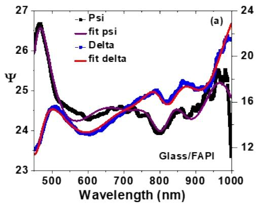
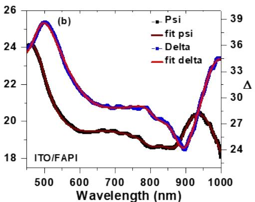
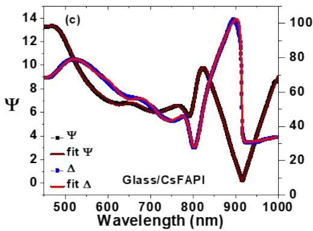
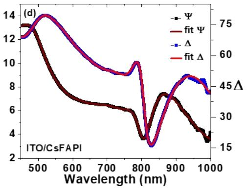
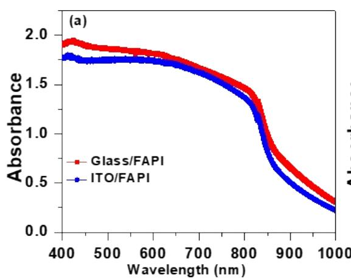
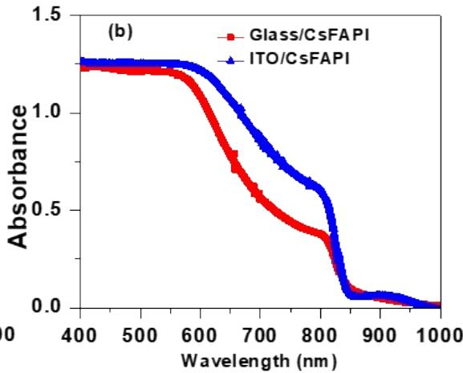
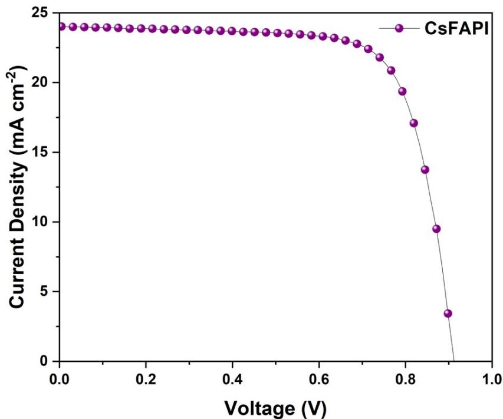
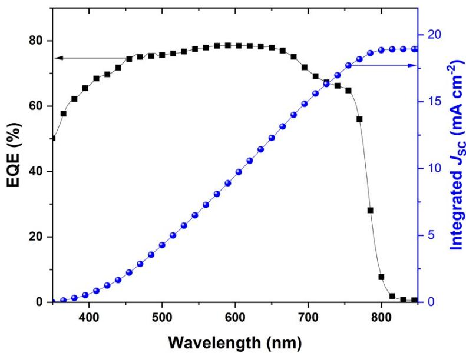

# Optical constants manipulation of formamidinium lead iodide perovskites: Ellipsometric and spectroscopic twigging

Mohd Taukeer Khan,a Muhammed P. U. Haris,b Baraa Alhouri,a Samrana Kazim,b,c,d Shahzada Ahmad b,d

aDepartment of Physics, Faculty of Science, Islamic University of Madinah, Prince Naifbin Abdulaziz, Al Jamiah, Madinah 42351, Kingdom of Saudi Arabia   
bBCMaterials, Basque Center for Materials, Applications, and Nanostructures, UPV/EHU Science Park, 48940, Leioa, Spain

Email: shahzada.ahmad@bcmaterials.net

cMaterials Physics Center, CSIC-UPV/EHU, Paseo Manuel de Lardizabal 5, 20018, Donostia - San Sebastian, Spain   
dIKERBASQUE, Basque Foundation for Science, Bilbao, 48009, Spain

# S1. Fitting of Spectroscopic Ellipsometer data

  
Figure S1. The measured amplitude ratio $( \Psi )$ and phase difference $( \Delta )$ of the FAPI and CsFAPI thin films on glass and ITO.

Table S1. Tauc-Lorentz fit parameters for FAPI and CsFAPI thin films on glass and ITO.   

<table><tr><td>Sample</td><td>Glass/FAPI</td><td>ITO/FAPI</td><td>Glass/CsFAPI</td><td>ITO/ CsFAPI</td></tr><tr><td>r (nm)</td><td>15</td><td>23</td><td>21</td><td>15</td></tr><tr><td>Void (%)</td><td>20</td><td>23</td><td>12</td><td>9</td></tr><tr><td>ε∞</td><td>1.25</td><td>1.24</td><td>1.10</td><td>1.01</td></tr><tr><td>A1</td><td>3.43</td><td>30.55</td><td>24.53</td><td>6.16</td></tr><tr><td>E1</td><td>1.55</td><td>1.45</td><td>1.57</td><td>1.58</td></tr><tr><td>C1</td><td>0.19</td><td>0.44</td><td>0.13</td><td>0.13</td></tr><tr><td>A2</td><td>44.45</td><td>52.101</td><td>7.60</td><td>6.52</td></tr><tr><td>E2</td><td>2.18</td><td>2.18</td><td>2.46</td><td>2.45</td></tr><tr><td>C2</td><td>4.35</td><td>3.70</td><td>0.49</td><td>0.54</td></tr><tr><td>A3</td><td>0.83</td><td>1.00</td><td>6.50</td><td>8.26</td></tr><tr><td>E3</td><td>2.70</td><td>2.45</td><td>3.31</td><td>3.18</td></tr><tr><td>C3</td><td>0.41</td><td>0.49</td><td>3.89</td><td>0.61</td></tr><tr><td>χ2</td><td>0.18</td><td>0.03</td><td>0.10</td><td>0.03</td></tr></table>

  
Figure S2. The absorption spectra of (a) $\mathsf { F A P b l } _ { 3 }$ , and (b) $\mathsf { C s F A P b l } _ { 3 }$ thin films.

Table S2: Energy bandgap of FAPI and CsFAPI thin films on glass and ITO.   

<table><tr><td>Sample</td><td>Eg</td></tr><tr><td>Glass/ FAPI</td><td>1.49 Ev</td></tr><tr><td>Glass/ITO/FAPI</td><td>1.50 eV</td></tr><tr><td>Glass/CsFAPI</td><td>1.59 eV</td></tr><tr><td>Glass/ITO/CsFAPI</td><td>1.58 eV</td></tr></table>

  
Figure S3. J-V characteristics under illumination of a typical CsFAPI-based perovskites solar cell.

  
Figure S4. EQE characteristics of a typical CsFAPI-based perovskites solar cell.