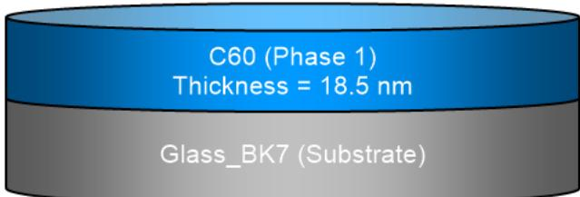
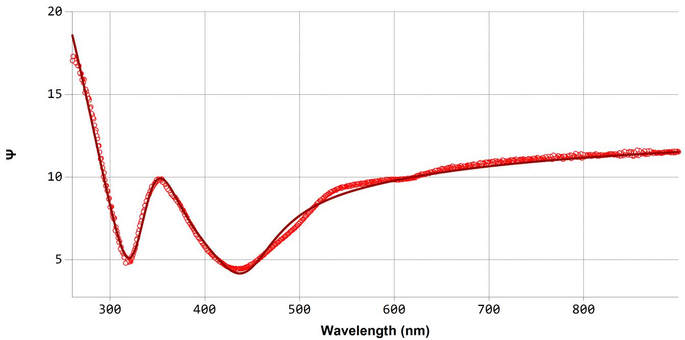
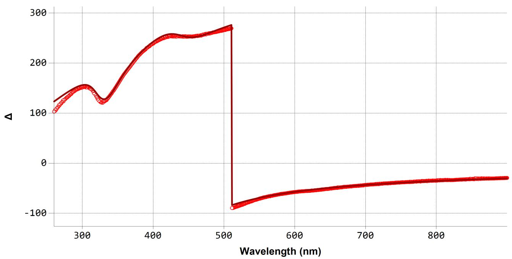
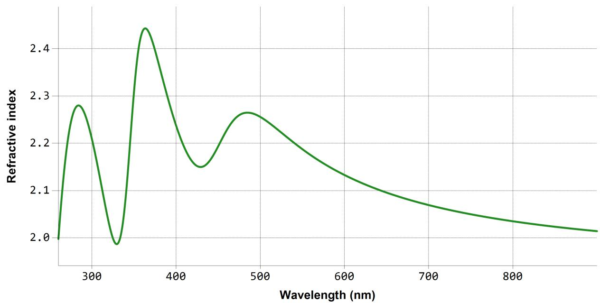
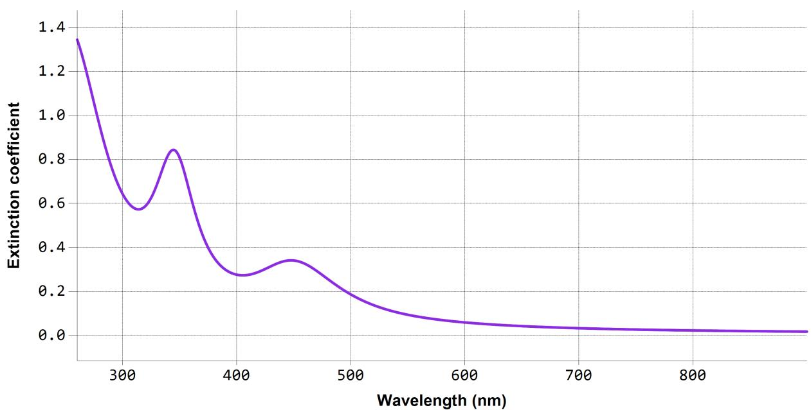
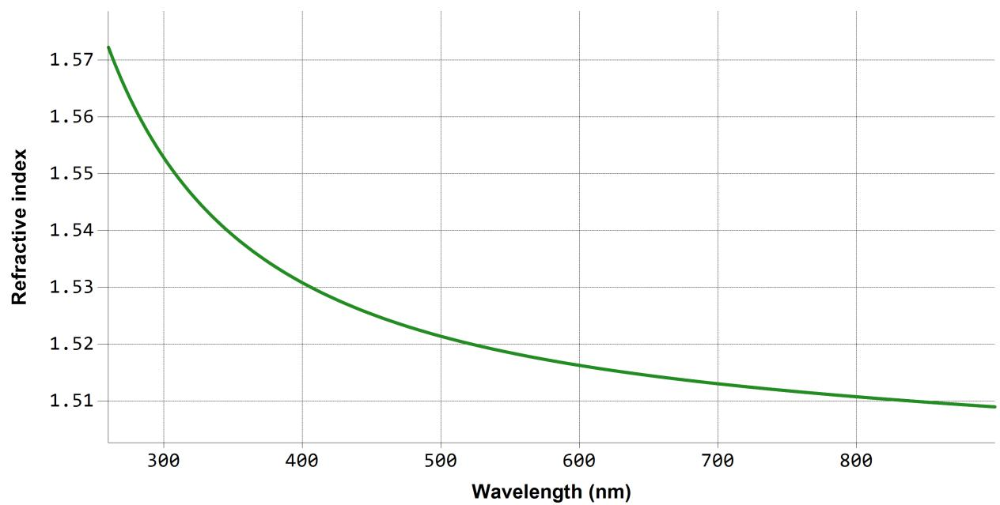
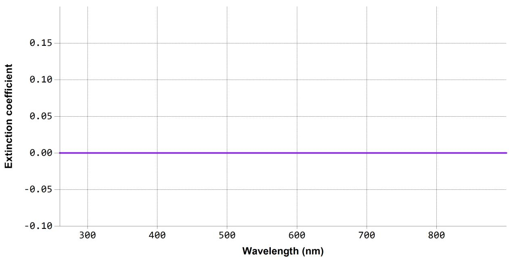

# SEA reg ression report su m mary

# Sam ple I D

C60-20-g lass- 后 后 后 - 1

D eta i l s   

<table><tr><td colspan="2">Software and regression log</td></tr><tr><td>Software about</td><td>Semilab - Spectroscopic Ellipsometry Analyzer - SEA</td></tr><tr><td>Software version</td><td>1.8.0.4</td></tr><tr><td>Officially licensed to</td><td>Linyang Jiangsu</td></tr><tr><td>Operator</td><td>operator</td></tr><tr><td>Date and time of regression</td><td>07-04-2026 16:54</td></tr><tr><td>Comments</td><td></td></tr></table>

# Layer structu re

Overview

Optical model   

<table><tr><td>Phase 1</td><td>C60</td></tr><tr><td>Dispersion law</td><td>Tauc-Lorentz</td></tr><tr><td></td><td>Lorentz</td></tr><tr><td></td><td>Lorentz</td></tr></table>

# Reg ress ion resu lts

<table><tr><td colspan="5">Measurement information</td></tr><tr><td>Measurement file path</td><td colspan="4">C:\Users\jjun.zhang\Desktop\□□□□□\ C60-20-glass-□□□-1.smdx</td></tr><tr><td>Angle of Incidence</td><td colspan="4">64.6°</td></tr><tr><td colspan="5">Regression details</td></tr><tr><td colspan="5">Regression 1 (EllipsoReflectance)</td></tr><tr><td>Wavelength range</td><td colspan="4">260.19 - 899.93 nm</td></tr><tr><td>Angle of Incidence</td><td colspan="4">64.6°</td></tr><tr><td>Fit to</td><td colspan="4">Ψ, Δ</td></tr><tr><td>Angular Aperture</td><td colspan="4">0°</td></tr><tr><td>Fit algorithm</td><td colspan="4">LMA</td></tr><tr><td colspan="5">Results</td></tr><tr><td>Parameters</td><td>Value</td><td>Fitted</td><td>2 σ confidence limit</td><td>Unit</td></tr><tr><td colspan="5">Model</td></tr><tr><td>AOI Shift</td><td>0</td><td></td><td></td><td>°</td></tr><tr><td>Angular Aperture</td><td>0</td><td></td><td></td><td>°</td></tr><tr><td colspan="5">Phase 1 (C60)</td></tr><tr><td>Thickness</td><td>18.494</td><td>X</td><td>0.07288</td><td>nm</td></tr><tr><td>A (eV)</td><td>25.25319</td><td></td><td></td><td>eV</td></tr><tr><td>E0 (eV)</td><td>4.7205</td><td></td><td></td><td>eV</td></tr><tr><td>C (eV)</td><td>1.34603</td><td></td><td></td><td>eV</td></tr><tr><td>Eg (eV)</td><td>2.22511</td><td>X</td><td>0.0039054</td><td>eV</td></tr><tr><td>f</td><td>0.35695</td><td></td><td></td><td></td></tr><tr><td>E0 (eV)</td><td>3.55858</td><td></td><td></td><td>eV</td></tr><tr><td>Γ (eV)</td><td>0.43402</td><td>X</td><td>0.0030298</td><td>eV</td></tr><tr><td>f</td><td>0.26273</td><td></td><td></td><td></td></tr><tr><td>E0 (eV)</td><td>2.7432</td><td></td><td></td><td>eV</td></tr><tr><td>Γ (eV)</td><td>0.58411</td><td>X</td><td>0.006296</td><td>eV</td></tr><tr><td>Eps_inf</td><td>1.93708</td><td></td><td></td><td></td></tr><tr><td>Derived parameters</td><td colspan="4">Value</td></tr><tr><td colspan="5">Phase 1 (C60)</td></tr><tr><td>n @ 632.8 nm</td><td colspan="4">2.107</td></tr><tr><td>k @ 632.8 nm</td><td colspan="4">0.0476</td></tr><tr><td colspan="5">Substrate (Glass_BK7)</td></tr><tr><td>n @ 632.8 nm</td><td colspan="4">1.5151</td></tr><tr><td>k @ 632.8 nm</td><td colspan="4">0</td></tr><tr><td colspan="5">Fit quality</td></tr><tr><td>R^2</td><td colspan="4">0.99551</td></tr><tr><td>RMSE</td><td colspan="4">0.19526</td></tr></table>

  
Reg ression g raphs

<table><tr><td>—</td><td>C60-20-glass-□□□- 1 Measured</td><td>—</td><td>C60-20-glass-□□□- 1 After Fit</td></tr></table>

  
Reg ression g raphs

<table><tr><td>—</td><td>C60-20-glass-□□□- 1 Measured</td><td>—</td><td>C60-20-glass-□□□- 1 After Fit</td></tr></table>

  
Phase 1 (C60) - D ispers ion g raphs

  
Su bstrate (G lass B K7) - D ispers ion g raphs

<table><tr><td colspan="5">Correlation coefficients</td></tr><tr><td></td><td>Ph1 - C60 - Thickness</td><td>Ph1 - Tauc-Lorentz[1] - Eg (eV)</td><td>Ph1 - Lorentz[2] - Γ (eV)</td><td>Ph1 - Lorentz[3] - Γ (eV)</td></tr><tr><td>Ph1 - C60 - Thickness</td><td>1</td><td>0.6691</td><td>0.2204</td><td>0.1306</td></tr><tr><td>Ph1 - Tauc-Lorentz[1] - Eg (eV)</td><td></td><td>1</td><td>-0.0547</td><td>0.2206</td></tr><tr><td>Ph1 - Lorentz[2] - Γ (eV)</td><td></td><td></td><td>1</td><td>0.1771</td></tr><tr><td>Ph1 - Lorentz[3] - Γ (eV)</td><td></td><td></td><td></td><td>1</td></tr></table>