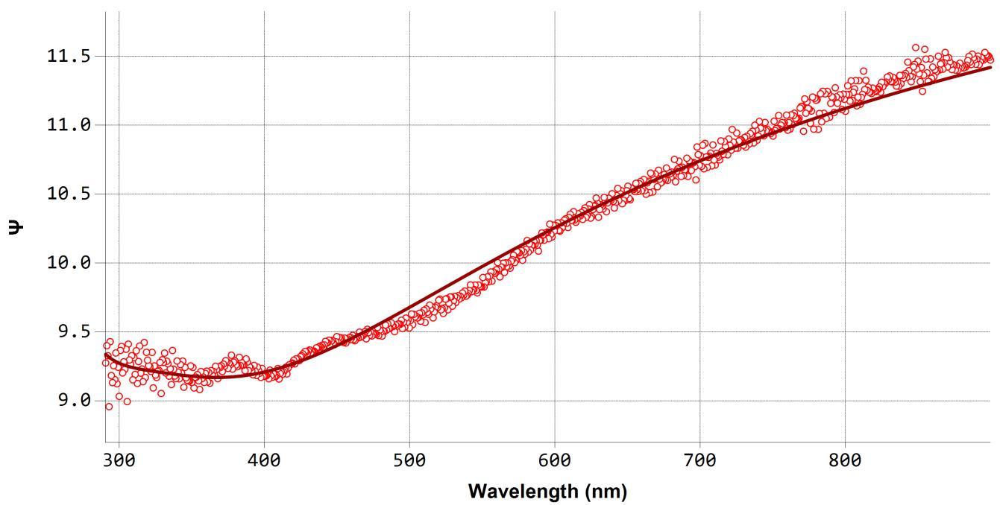
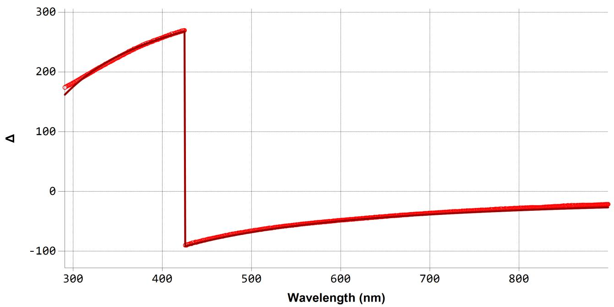
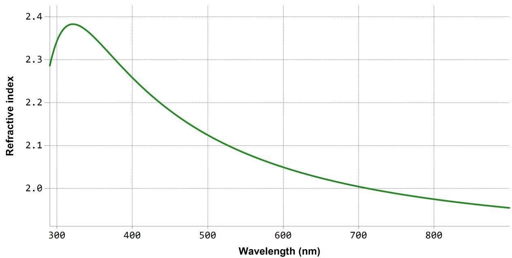
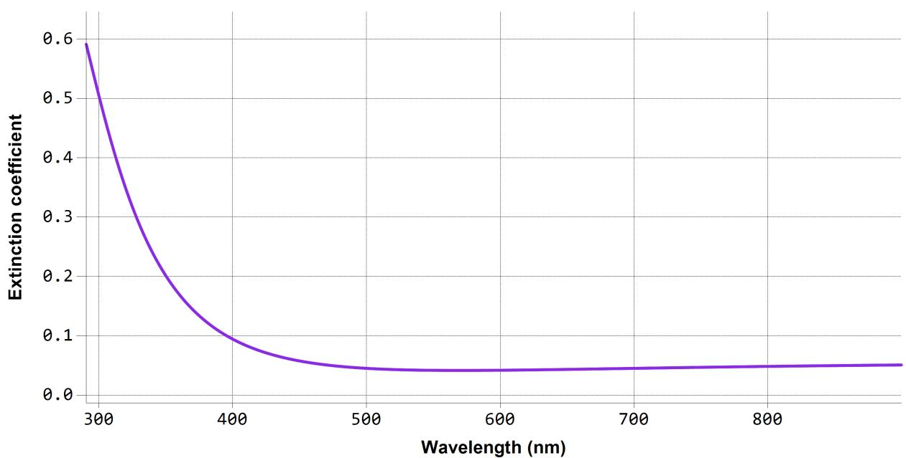
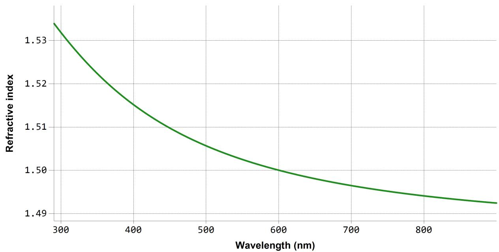
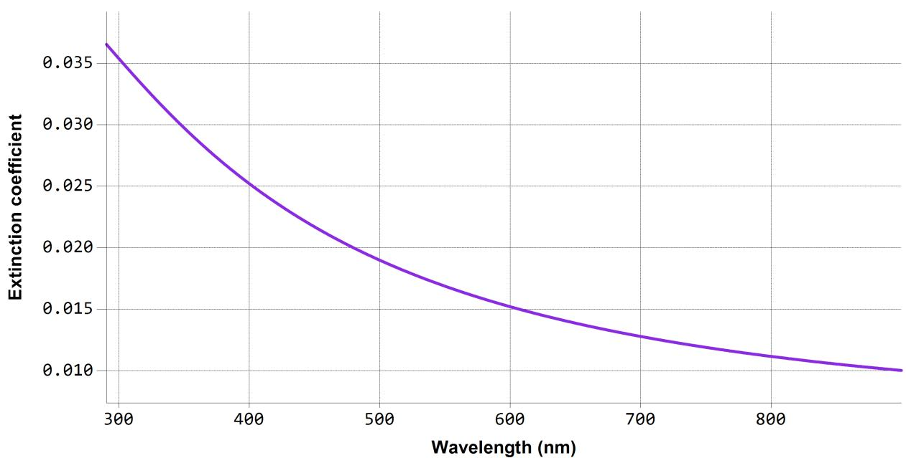

# SEA reg ression report su m mary

# Sam ple I D

ITO-20-g lass- 后 后 后 - 1

D eta i l s   

<table><tr><td colspan="2">Software and regression log</td></tr><tr><td>Software about</td><td>Semilab - Spectroscopic Ellipsometry Analyzer - SEA</td></tr><tr><td>Software version</td><td>1.8.0.4</td></tr><tr><td>Officially licensed to</td><td>Linyang Jiangsu</td></tr><tr><td>Operator</td><td>operator</td></tr><tr><td>Date and time of regression</td><td>07-04-2026 17:00</td></tr><tr><td>Comments</td><td></td></tr></table>

# Layer structu re

Overview

ITO_(glass) (Phase 2)

Thickness = 19.6 nm

Optical model   

<table><tr><td>Phase 2</td><td>ITO_(glass)</td></tr><tr><td>Dispersion law</td><td>Cauchy</td></tr><tr><td></td><td>Lorentz</td></tr></table>

# Reg ress ion resu lts

<table><tr><td colspan="5">Measurement information</td></tr><tr><td>Measurement file path</td><td colspan="4">C:\Users\jijun.zhang\Desktop\☐☐☐☐☐☐\ ITO-20-glass-☐☐☐-1.smdx</td></tr><tr><td>Angle of Incidence</td><td colspan="4">64.6°</td></tr><tr><td colspan="5">Regression details</td></tr><tr><td colspan="5">Regression 1 (EllipsoReflectance)</td></tr><tr><td>Wavelength range</td><td colspan="4">290.61 - 899.93 nm</td></tr><tr><td>Angle of Incidence</td><td colspan="4">64.6°</td></tr><tr><td>Fit to</td><td colspan="4">Ψ, Δ</td></tr><tr><td>Angular Aperture</td><td colspan="4">0°</td></tr><tr><td>Fit algorithm</td><td colspan="4">LMA</td></tr><tr><td colspan="5">Results</td></tr><tr><td>Parameters</td><td>Value</td><td>Fitted</td><td>2 σ confidence limit</td><td>Unit</td></tr><tr><td colspan="5">Model</td></tr><tr><td>AOI Shift</td><td>0</td><td></td><td></td><td>°</td></tr><tr><td>Angular Aperture</td><td>0</td><td></td><td></td><td>°</td></tr><tr><td colspan="5">Phase 2 (ITO_(glass))</td></tr><tr><td>Thickness</td><td>19.595</td><td>X</td><td>0.033848</td><td>nm</td></tr><tr><td>B (μm^2)</td><td>0.046758</td><td></td><td></td><td>μm^2</td></tr><tr><td>C (μm^4)</td><td>1.706E-09</td><td></td><td></td><td>μm^4</td></tr><tr><td>D</td><td>0.055902</td><td></td><td></td><td></td></tr><tr><td>E (μm^2)</td><td>-0.077691</td><td></td><td></td><td>μm^2</td></tr><tr><td>F (μm^4)</td><td>0.0022355</td><td>X</td><td>1.7982E-05</td><td>μm^4</td></tr><tr><td>f</td><td>2.04999</td><td></td><td></td><td></td></tr><tr><td>E0 (eV)</td><td>4.68503</td><td></td><td></td><td>eV</td></tr><tr><td>Γ (eV)</td><td>1.89563</td><td>X</td><td>0.001484</td><td>eV</td></tr><tr><td>Eps_inf</td><td>0.15227</td><td></td><td></td><td></td></tr><tr><td>N_inf</td><td>1.15106</td><td></td><td></td><td></td></tr><tr><td>Derived parameters</td><td colspan="4">Value</td></tr><tr><td colspan="5">Phase 2 (ITO_(glass))</td></tr><tr><td>n @ 632.8 nm</td><td colspan="4">2.0323</td></tr><tr><td>k @ 632.8 nm</td><td colspan="4">0.0428</td></tr><tr><td colspan="5">Substrate (1mm Glass)</td></tr><tr><td>n @ 632.8 nm</td><td colspan="4">1.4987</td></tr><tr><td>k @ 632.8 nm</td><td colspan="4">0.0143</td></tr><tr><td colspan="5">Fit quality</td></tr><tr><td>R^2</td><td colspan="4">0.99496</td></tr><tr><td>RMSE</td><td colspan="4">0.05936</td></tr></table>

  
Reg ression g raphs

<table><tr><td>—</td><td>ITO-20-glass-□□□- 1 Measured</td><td>—</td><td>ITO-20-glass-□□□- 1 Fit</td></tr></table>

  
Reg ression g raphs

<table><tr><td>-</td><td>ITO-20-glass-□□□- 1 Measured</td><td>-</td><td>ITO-20-glass-□□□- 1 Fit</td></tr></table>

  
Phase 2 (ITO (g lass)) - D ispers ion g raphs

  
Su bstrate (1 m m G lass) - D ispers ion g raphs

<table><tr><td colspan="4">Correlation coefficients</td></tr><tr><td></td><td>Ph2 - ITO_(glass) - Thickness</td><td>Ph2 - Cauchy[1] - F (μm^4)</td><td>Ph2 - Lorentz[2] - Γ (eV)</td></tr><tr><td>Ph2 - ITO_(glass) - Thickness</td><td>1</td><td>-0.6271</td><td>0.1973</td></tr><tr><td>Ph2 - Cauchy[1] - F (μm^4)</td><td></td><td>1</td><td>-0.0045</td></tr><tr><td>Ph2 - Lorentz[2] - Γ (eV)</td><td></td><td></td><td>1</td></tr></table>