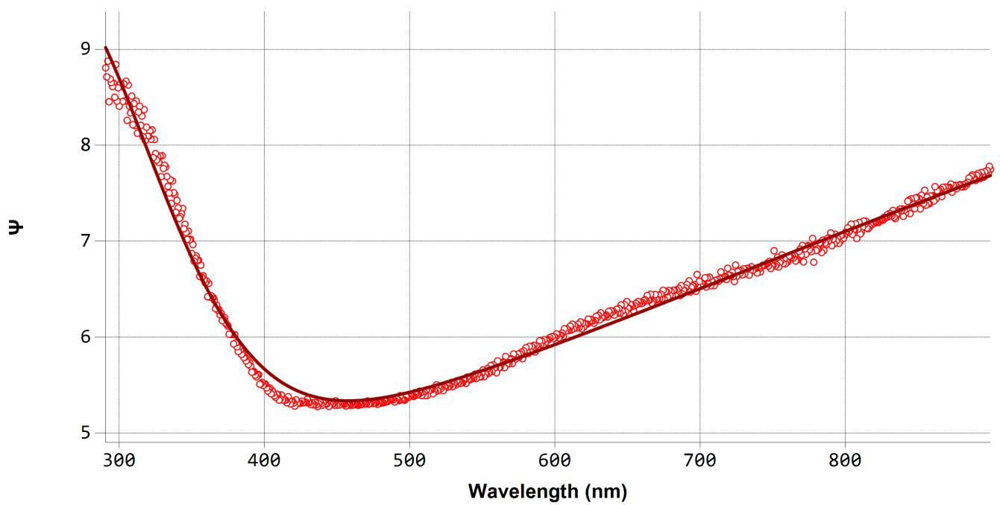
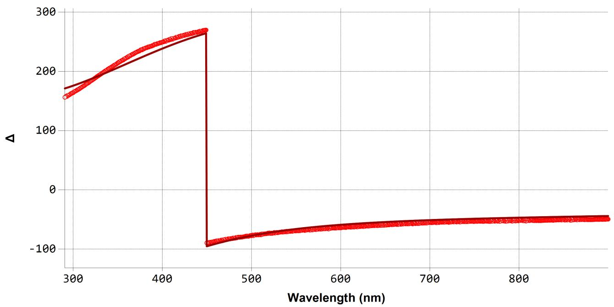
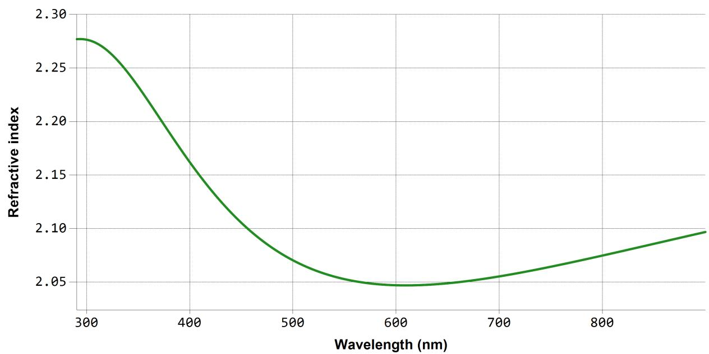
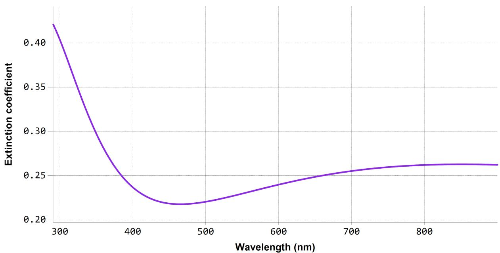
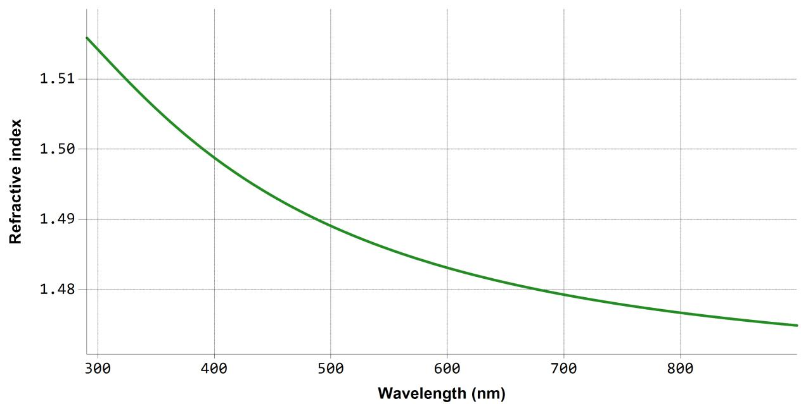
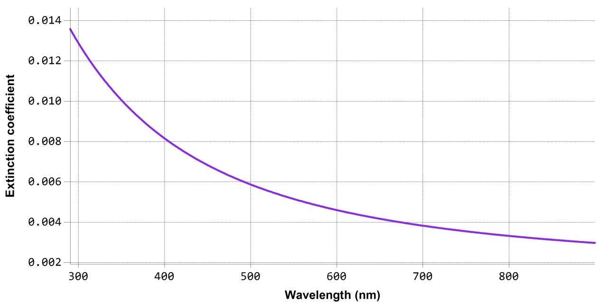

# SEA reg ression report su m mary

# Sam ple I D

5 - 1

D eta i l s   
Layer structu re   

<table><tr><td colspan="2">Software and regression log</td></tr><tr><td>Software about</td><td>Semilab - Spectroscopic Ellipsometry Analyzer - SEA</td></tr><tr><td>Software version</td><td>1.8.0.4</td></tr><tr><td>Officially licensed to</td><td>Linyang Jiangsu</td></tr><tr><td>Operator</td><td>operator</td></tr><tr><td>Date and time of regression</td><td>07-04-2026 16:59</td></tr><tr><td>Comments</td><td></td></tr></table>

Overview

NiOx (Phase 2)

Thickness = 22.4 nm

Optical model   

<table><tr><td>Phase 2</td><td>NiOx</td></tr><tr><td>Dispersion law</td><td>Tauc-Lorentz</td></tr><tr><td></td><td>Gauss</td></tr><tr><td></td><td>Lorentz</td></tr></table>

# Reg ress ion resu lts

<table><tr><td colspan="5">Measurement information</td></tr><tr><td>Measurement file path</td><td colspan="4">C:\Users\jjun.zhang\Desktop\SE2000\□□\ 0813\NIO\MF-8KW-0.5-4.4-18\5-1.smdx</td></tr><tr><td>Angle of Incidence</td><td colspan="4">64.6°</td></tr><tr><td colspan="5">Regression details</td></tr><tr><td colspan="5">Regression 1 (EllipsoReflectance)</td></tr><tr><td>Wavelength range</td><td colspan="4">290.61 - 899.93 nm</td></tr><tr><td>Angle of Incidence</td><td colspan="4">64.6°</td></tr><tr><td>Fit to</td><td colspan="4">Ψ, Δ</td></tr><tr><td>Angular Aperture</td><td colspan="4">0°</td></tr><tr><td>Fit algorithm</td><td colspan="4">LMA</td></tr><tr><td colspan="5">Results</td></tr><tr><td>Parameters</td><td>Value</td><td>Fitted</td><td>2 σ confidence limit</td><td>Unit</td></tr><tr><td colspan="5">Model</td></tr><tr><td>AOI Shift</td><td>0</td><td></td><td></td><td>°</td></tr><tr><td>Angular Aperture</td><td>0</td><td></td><td></td><td>°</td></tr><tr><td colspan="5">Phase 2 (NiOx)</td></tr><tr><td>Thickness</td><td>22.443</td><td>X</td><td>0.030307</td><td>nm</td></tr><tr><td>A (eV)</td><td>61.48773</td><td></td><td></td><td>eV</td></tr><tr><td>E0 (eV)</td><td>7.1813</td><td></td><td></td><td>eV</td></tr><tr><td>C (eV)</td><td>1.0016E-15</td><td></td><td></td><td>eV</td></tr><tr><td>Eg (eV)</td><td>2.95995</td><td></td><td></td><td>eV</td></tr><tr><td>Amp</td><td>1.68799</td><td>X</td><td>0.007089</td><td></td></tr><tr><td>E0 (eV)</td><td>4.61996</td><td>X</td><td>0.019915</td><td>eV</td></tr><tr><td>Br (eV)</td><td>2.12908</td><td>X</td><td>0.036164</td><td>eV</td></tr><tr><td>f</td><td>1.71587</td><td></td><td></td><td></td></tr><tr><td>E0 (eV)</td><td>2.42066</td><td></td><td></td><td>eV</td></tr><tr><td>Γ (eV)</td><td>5</td><td></td><td></td><td>eV</td></tr><tr><td>Eps_inf</td><td>1.4488E-05</td><td></td><td></td><td></td></tr><tr><td>Derived parameters</td><td colspan="4">Value</td></tr><tr><td colspan="5">Phase 2 (NiOx)</td></tr><tr><td>n @ 632.8 nm</td><td colspan="4">2.0476</td></tr><tr><td>k @ 632.8 nm</td><td colspan="4">0.2458</td></tr><tr><td colspan="5">Substrate (□□□9.8)</td></tr><tr><td>n @ 632.8 nm</td><td colspan="4">1.4817</td></tr><tr><td>k @ 632.8 nm</td><td colspan="4">0.0043</td></tr><tr><td colspan="5">Fit quality</td></tr><tr><td>R^2</td><td colspan="4">0.99432</td></tr><tr><td>RMSE</td><td colspan="4">0.07966</td></tr></table>

  
Reg ression g raphs

<table><tr><td>—</td><td>5-1 Measured</td><td>—</td><td>5-1 Fit</td></tr></table>

  
Reg ression g raphs

<table><tr><td>—</td><td>5-1 Measured</td><td>—</td><td>5-1 Fit</td></tr></table>

  
Phase 2 (N iOx) - D ispers ion g raphs

  
Su bstrate ( 璃 璃 璃 9.8) - D ispers ion g raphs

<table><tr><td colspan="5">Correlation coefficients</td></tr><tr><td></td><td>Ph2 - NiOx - Thickness</td><td>Ph2 - Gauss[2] - Amp</td><td>Ph2 - Gauss[2] - E0 (eV)</td><td>Ph2 - Gauss[2] - Br (eV)</td></tr><tr><td>Ph2 - NiOx - Thickness</td><td>1</td><td>0.1309</td><td>-0.3962</td><td>-0.4884</td></tr><tr><td>Ph2 - Gauss[2] - Amp</td><td></td><td>1</td><td>-0.7865</td><td>-0.4433</td></tr><tr><td>Ph2 - Gauss[2] - E0 (eV)</td><td></td><td></td><td>1</td><td>0.7807</td></tr><tr><td>Ph2 - Gauss[2] - Br (eV)</td><td></td><td></td><td></td><td>1</td></tr></table>