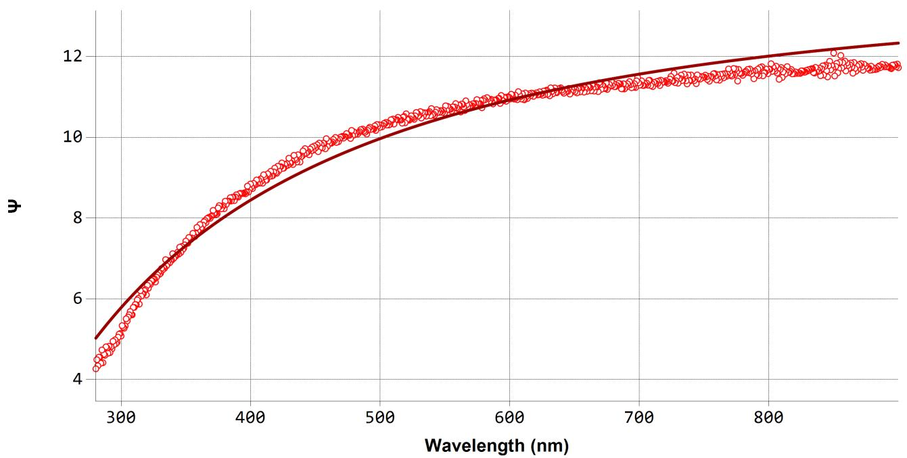
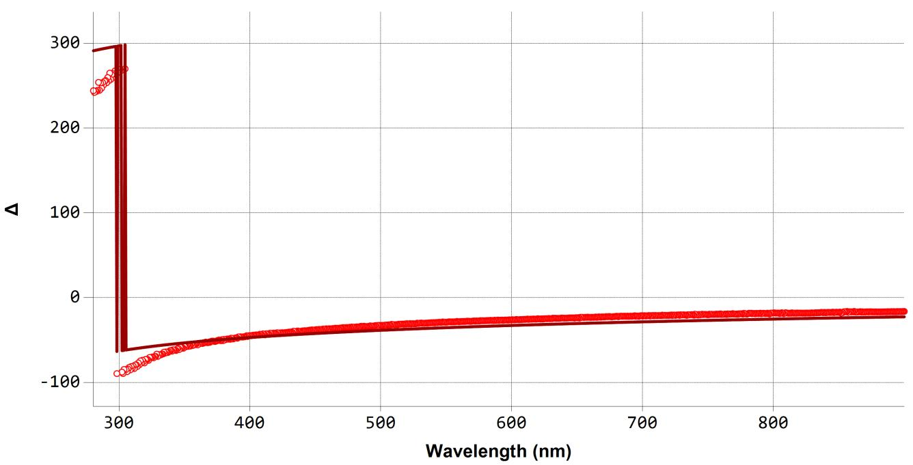
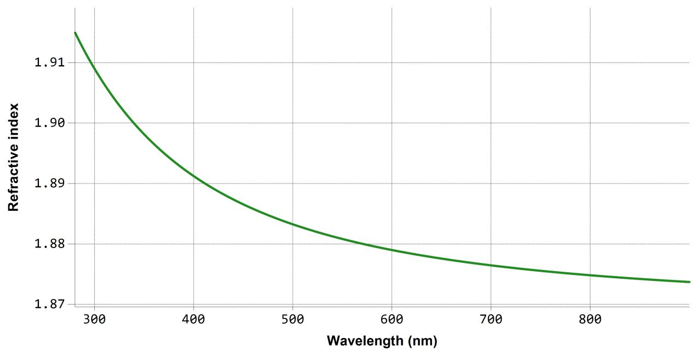
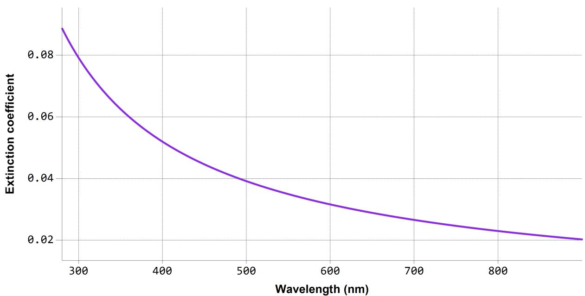
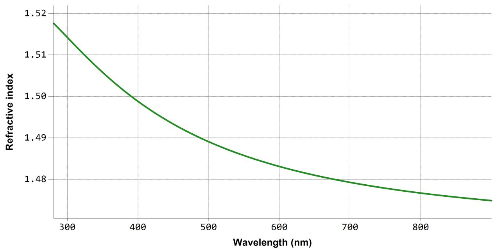

# SEA reg ression report su m mary

# Sam ple I D

1 -3

D eta i l s   

<table><tr><td colspan="2">Software and regression log</td></tr><tr><td>Software about</td><td>Semilab - Spectroscopic Ellipsometry Analyzer - SEA</td></tr><tr><td>Software version</td><td>1.8.0.4</td></tr><tr><td>Officially licensed to</td><td>Linyang Jiangsu</td></tr><tr><td>Operator</td><td>operator</td></tr><tr><td>Date and time of regression</td><td>07-04-2026 16:48</td></tr><tr><td>Comments</td><td></td></tr></table>

# Layer structu re

Overview

SnOx (Phase 1)

Thickness = 20.2 nm

Optical model   

<table><tr><td>Phase 1</td><td>SnOx</td></tr><tr><td>Dispersion law</td><td>Lorentz</td></tr><tr><td></td><td>Tauc-Lorentz</td></tr></table>

# Reg ress ion resu lts

<table><tr><td colspan="5">Measurement information</td></tr><tr><td>Measurement file path</td><td colspan="4">C:\Result\2026\2~3\20260327\SnOx\1-3.smdx</td></tr><tr><td>Angle of Incidence</td><td colspan="4">64.6°</td></tr><tr><td colspan="5">Regression details</td></tr><tr><td colspan="5">Regression 1 (EllipsoReflectance)</td></tr><tr><td>Wavelength range</td><td colspan="4">280.47 - 899.93 nm</td></tr><tr><td>Angle of Incidence</td><td colspan="4">64.6°</td></tr><tr><td>Fit to</td><td colspan="4">Ψ, Δ</td></tr><tr><td>Angular Aperture</td><td colspan="4">0°</td></tr><tr><td>Fit algorithm</td><td colspan="4">LMA</td></tr><tr><td colspan="5">Results</td></tr><tr><td>Parameters</td><td>Value</td><td>Fitted</td><td>2 σ confidence limit</td><td>Unit</td></tr><tr><td colspan="5">Model</td></tr><tr><td>AOI Shift</td><td>0</td><td></td><td></td><td>°</td></tr><tr><td>Angular Aperture</td><td>0</td><td></td><td></td><td>°</td></tr><tr><td colspan="5">Phase 1 (SnOx)</td></tr><tr><td>Thickness</td><td>20.156</td><td>X</td><td>0.31921</td><td>nm</td></tr><tr><td>f</td><td>1.04429</td><td></td><td></td><td></td></tr><tr><td>E0 (eV)</td><td>9.91314</td><td>X</td><td>0.57219</td><td>eV</td></tr><tr><td>Γ (eV)</td><td>5</td><td>X</td><td>0.75072</td><td>eV</td></tr><tr><td>A (eV)</td><td>0</td><td></td><td></td><td>eV</td></tr><tr><td>E0 (eV)</td><td>10</td><td></td><td></td><td>eV</td></tr><tr><td>C (eV)</td><td>5</td><td></td><td></td><td>eV</td></tr><tr><td>Eg (eV)</td><td>0</td><td></td><td></td><td>eV</td></tr><tr><td>Eps_inf</td><td>2.45093</td><td></td><td></td><td></td></tr><tr><td>Derived parameters</td><td colspan="4">Value</td></tr><tr><td colspan="5">Phase 1 (SnOx)</td></tr><tr><td>n @ 632.8 nm</td><td colspan="4">1.878</td></tr><tr><td>k @ 632.8 nm</td><td colspan="4">0.0297</td></tr><tr><td colspan="5">Substrate (□□□9.8)</td></tr><tr><td>n @ 632.8 nm</td><td colspan="4">1.4817</td></tr><tr><td>k @ 632.8 nm</td><td colspan="4">0.0043</td></tr><tr><td colspan="5">Fit quality</td></tr><tr><td>R^2</td><td colspan="4">0.98323</td></tr><tr><td>RMSE</td><td colspan="4">0.28621</td></tr></table>

  
Reg ression g raphs

<table><tr><td>—</td><td>1-3 Measured</td><td>—</td><td>1-3 Fit</td></tr></table>

  
Reg ression g raphs

<table><tr><td>—</td><td>1-3 Measured</td><td>—</td><td>1-3 Fit</td></tr></table>

  
Phase 1 (S nOx) - D ispers ion g raphs

  
Su bstrate ( 璃 璃 璃 9.8) - D ispers ion g raphs

<table><tr><td colspan="4">Correlation coefficients</td></tr><tr><td></td><td>Ph1 - SnOx - Thickness</td><td>Ph1 - Lorentz[1] - E0 (eV)</td><td>Ph1 - Lorentz[1] - Γ (eV)</td></tr><tr><td>Ph1 - SnOx - Thickness</td><td>1</td><td>0.2944</td><td>-0.1539</td></tr><tr><td>Ph1 - Lorentz[1] - E0 (eV)</td><td></td><td>1</td><td>0.8886</td></tr><tr><td>Ph1 - Lorentz[1] - Γ (eV)</td><td></td><td></td><td>1</td></tr></table>